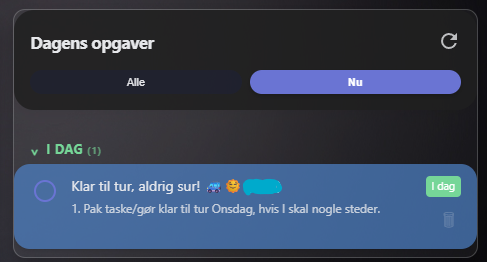
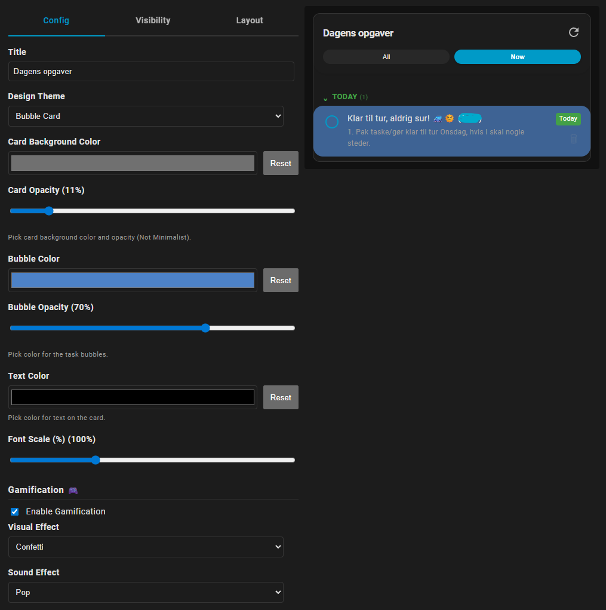
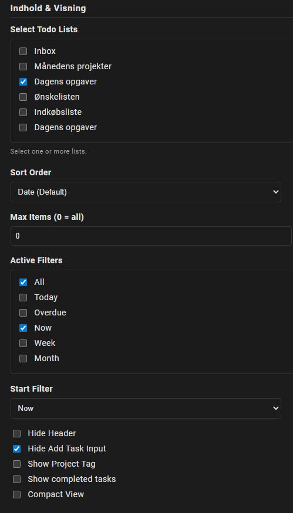

# Todoist Task Flow for Home Assistant

An advanced, yet easy-to-use card for Home Assistant that displays your Todoist tasks. It is designed to look and feel like a "native" app directly in your dashboard.

The card now has two compatible data modes:

- `custom:todoist-task-flow` retains the original Home Assistant `todo` entity behavior.
- `custom:todoist-kiosk-card` uses the companion `todoist_kiosk` custom integration for native Todoist filters, rich metadata, recurring-safe completion, and Quick Add.

## Todoist Kiosk mode

Install and configure the companion [`ha-todoist-enhanced`](https://github.com/Zensqrl/ha-todoist-enhanced) integration first. The Todoist API token is stored only in Home Assistant; this card talks exclusively to Home Assistant over its authenticated WebSocket connection.

The header selector combines every active project, saved Todoist filter, and named raw query, using `Project: ` and `Filter: ` prefixes:

```yaml
type: custom:todoist-kiosk-card
title: Tasks
raw_filters:
  - id: month_ahead
    name: Month Ahead
    query: "due before: first day"
default_source:
  kind: raw_filter
  id: month_ahead
```

The visual editor generates raw-filter IDs and lets you manage the queries and choose the default. Selecting another source on the card affects only the displayed tasks and resets after a dashboard reload. Quick Add behavior is unchanged.

Raw-filter example:

```yaml
type: custom:todoist-kiosk-card
title: Tasks
filter: >-
  (due before: first day | deadline before: first day) &
  (!#Daily Checklist | today)
show_project: true
show_due: true
show_deadline: true
show_priority: true
show_labels: false
allow_complete: true
allow_quick_add: true
```

Saved filters are preferable when the query should remain managed in Todoist:

```yaml
type: custom:todoist-kiosk-card
title: Tasks
filter_name: Kiosk Upcoming
```

For duplicate saved-filter names, configure the stable `filter_id` instead. Existing `project_id`, `filter`, `filter_name`, and `filter_id` configurations remain supported when `default_source` is absent. A legacy raw query is labeled `Filter: Custom Query`; set `filter_label` to customize that label.

## 🚀 Why this card? (The New Architecture)

This card is built specifically for Home Assistant's modern **`todoist` integration**.

Many older Todoist cards rely on:

* **Deprecated methods:** Reading task lists from sensor attributes (which bloats your database).

* **Calendar integration:** Which isn't designed for task management.

* **Iframes:** Embedding the entire Todoist website, which is heavy and slow on mobile.

**Todoist Task Flow** communicates directly with the official integration via efficient WebSocket calls. This means:

* **⚡️ Fast & Lightweight:** No attributes cluttering your state machine.

* **🔒 Secure:** Uses standard Home Assistant services (`todo.add_item`, `todo.update_item`).

* **🔮 Future-proof (hopefully):** Aligned with Home Assistant's long-term architecture for task lists.

## ✨ Features

* **🎨 Multiple Themes:** Choose between *Standard*, *Minimalist*, *Frosted Glass*, and *Bubble Card* designs.

* **🛠️ Customization:** Hide header, hide "add task", change colors, adjust font size, and much more directly in the visual editor.

* **🎮 Gamification:** Make chores fun with optional sound effects and confetti animations upon completion.

* **📅 Smart Dates:** Displays dates naturally like "Today", "Tomorrow", or "On Monday" instead of raw dates.

* **⚡️ Live Updates:** The card updates automatically and remembers your scroll position.

* **📱 Mobile Friendly:** Special "Compact View" and collapsible sections for small screens.

* **🗒️ Project tags:** Allows for multiple lists in the same overview, without needing vertical stacks.

## 📥 Installation

### Option 1: HACS (Recommended)

1. Go to HACS -> Frontend.

2. Click the menu in the top right corner -> **Custom repositories**.

3. Paste the URL of this GitHub repository.

4. Select category: **Lovelace**.

5. Click **Add** and then **Download**.

### Option 2: Manual

1. Download the `todoist-task-flow.js` file.

2. Upload it to your `/config/www/` folder in Home Assistant.

3. Go to Settings -> Dashboards -> Resources.

4. Add the resource: `/local/todoist-task-flow.js` as **JavaScript Module**.

## ⚙️ Configuration

The card is 100% configurable via the **visual editor** in Home Assistant. No YAML required!

If you prefer YAML, a typical configuration looks like this:

| Options 1/2 | Options 2/2 |
| :---: | :---: |
|  |  |

```yaml
type: custom:todoist-task-flow
title: My Tasks
entities:
  - todo.groceries
  - todo.work
theme: bubble
header_color: "#4caf50"
show_completed: false
default_filter: today
use_gamification: true
visual_effect: confetti
sound_effect: ding
```
## 🧩 Filtering & Sorting
You can choose which filter buttons to show:

* **All:** Shows everything in the lists.

* **Today:** Tasks due today.

* **Overdue:** Tasks you missed.

* **Now:** A combination of "Today" and "Overdue".

* **Week/Month:** Overview of the future.

## ♥️ Credit
Credits to my wife for pushing me to come up with a solution for our HA dashboard, that shows our todoist tasks correctly, and for helping me with features.
The card is made with a huge focus on WAF (Wife Acceptance Focus) and my ADHD brain (Possibility for gamification, limited tasks etc.)


